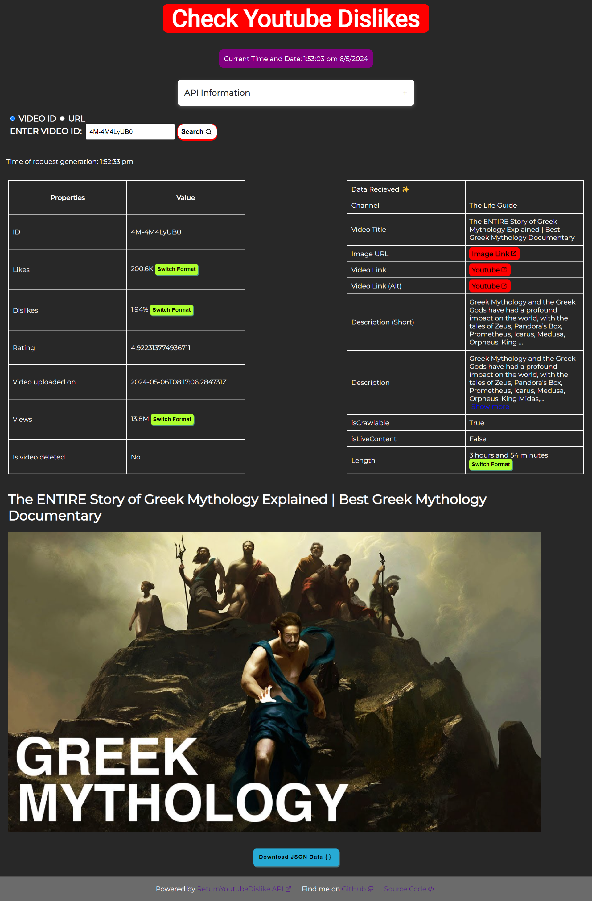

# CheckYoutubeDislike

   

## Run locally

### Client

```cmd
cd src/frontend
npm run dev
```

### Server

```cmd
cd src/server
npm run start 
```

For development

```cmd
npm run dev 
```

> Default port is set to 5001 for server.

## Description

Created a dynamic web application to retrieve YouTube dislikes utilizing the ReturnYoutubeDislike API and additional information through web scraping. Employed Express.js for backend development, while also utilizing web scraping tool puppeteer to gather supplementary data such as video duration, upload date, likes in multiple format and additional metadata.

## Features

- Retrieve the number of dislikes for a given YouTube video URL.
- Display additional information regarding that video with the help of webscrapping.
- Functionality to download the json data on request.

## Screenshots


